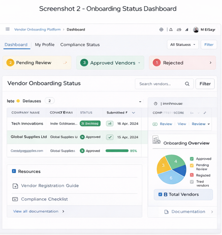

# Vendor Onboarding SaaS Flow

This repository documents a SaaS-based vendor onboarding workflow designed for enterprise financial systems.

## Overview

The platform replaces manual, email-based supplier onboarding with a structured, automated workflow that ensures compliance, completeness, and ERP readiness.

## Core Workflow

1. Supplier registration
2. Document submission
3. Validation checks
4. Internal review
5. Approval workflow
6. ERP-ready vendor creation

## User Roles

- Supplier / Vendor
- Finance Reviewer
- Compliance Reviewer
- System Administrator

## Key Features

- structured onboarding forms
- document upload and validation
- compliance checks
- approval routing
- status tracking
- ERP integration readiness

## Screenshots

### Vendor Registration Interface

### Onboarding Status Dashboard

## Business Value

This system enables:
- faster onboarding
- improved compliance
- reduced manual coordination
- full audit traceability
- scalable vendor management

## My Contribution

This work reflects my contribution to:
- SaaS product design
- onboarding workflow architecture
- compliance-aware system design
- enterprise process automation
- This work is independently developed and represents my personal contribution to SaaS product design and workflow architecture.

## Current Status

This repository represents the workflow and system design for a scalable vendor onboarding platform as part of a broader financial automation ecosystem.

## Repository Structure

- docs/ → documentation
- flows/ → onboarding workflow logic
- samples/ → structured vendor data
- screenshots/ → UI and flow visuals

  ## Why This Matters

Vendor onboarding is a critical bottleneck in enterprise finance operations. Traditional onboarding relies on manual communication, document exchange, and inconsistent validation processes.

This platform introduces:
- structured onboarding workflows
- standardized validation logic
- compliance-ready processes
- ERP integration readiness
  
## Why This Matters

Vendor onboarding is a critical bottleneck in enterprise finance operations. Traditional onboarding relies on manual communication, document exchange, and inconsistent validation processes.

This platform introduces:
- structured onboarding workflows
- standardized validation logic
- compliance-ready processes
- ERP integration readiness

This significantly improves operational efficiency and reduces onboarding risk.

This workflow integrates with AI-driven invoice processing pipelines to enable full end-to-end financial automation.

## Status

Architecture and workflow design repository representing a production-oriented SaaS onboarding system.
